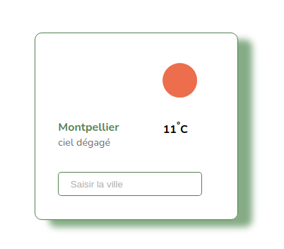

# Weather widget

A neutral and sobre weather widget to be added in projects, using open weather Api

### Built with

* React.js
* Sass
* Axios

## Installation

1. Get a free API Key at https://openweathermap.org/api
2. Clone the repo
3. Install NPM packages
4. create a `.env.local` file with your API Key in
5. run `npm start`
